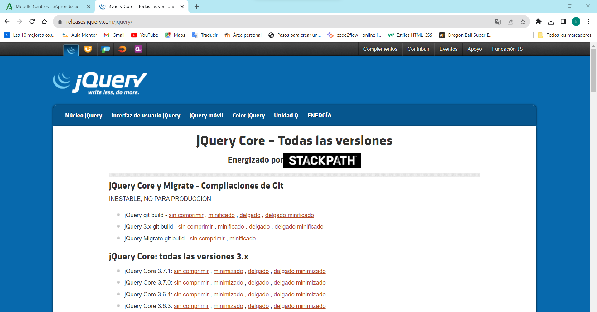
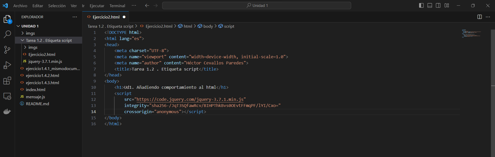

# Tarea 1.2. Etiqueta script: Añadiendo comportamiento al html

*Autor:* Héctor Cevallos Paredes

## Introducción: 
##### *Realizar las siguientes lecturas y responder a las siguientes cuestiones*

1. async vs defer attributes
2. Especificacion whatwg.org
3. Where should I put  <"script"> tags in HTML markup?
4. Etiqueta <"NOSCRIPT">, Curso práctico HTML5
5. La etiqueta noscript
6. Subresource Integrity (SRI) allows the browser to verify that the files being delivered have not been modified. crossorigin and integrity atributes

#### Descarga de jQuery.  
Para descargar jQuery nos dirigimos al sitio de descarga https://releases.jquery.com/jquery/ y seleccionamos la versión que queremos descargar en mi caso la version jQuery Core 3.7.1 minimizado que es mas ligera.

.

#### Genera la etiqueta script con los atributos integrity y crossorigin usados para el control Subresource Integrity (SRI).
Para generar una etiqueta <'script'> con los atributos integrity y crossorigin vamos al siguiente enlace https://releases.jquery.com/ y descargamos la version minimizada que es la que nos descargamos anteriormente, esto nos da un <'script'> que es el que tenemos que integrar en nuestro HTML.

Los atributos integrity y crossorigin se utilizan para comprobar la integridad de los subrecursos (SRI) . Esto permite a los navegadores asegurarse de que los recursos alojados en servidores de terceros no hayan sido manipulados. Se recomienda el uso de SRI como práctica recomendada siempre que las bibliotecas se carguen desde una fuente de terceros.

## Cuestionario 

### 1. Ventajas de incorporar el script desde un fichero externo frente a hacerlo en línea (código javascript directamente en el fichero HTML)
- Simplifica elcódigo de la página
- Se puede reutilizar el mismo código JavaScript en todas las páginas del sitio web.
- Cualquier modificación ralizada en el archivo JavaScript se ve reflejada inmediatamente en todas las páginas que lo enlazan.

### 2. Atributos aplicables a la etiqueta script.
- *async*: Este atributo booleano se utiliza para indicar al navegador que, si es posible, ejecute el código de forma asincróna.
- *integrity*: Contiene información de metadatos que es usada por el user agent del navegador para verificar que el recurso captado fue entregado libre de manipulaciones inesperadas.
- *src*: Este atributo especifica la URL del script externo que se debe cargar, lo usaremos como alternativa a scripts embebidos directamente en el documento.
- *defer*: Este atributo establece si el script debe ser ejecutado luego de que el documento entero sea analizado.
- *type*: Este atributo identifica el lenguaje de scripting en que está escritpo eñ código embebido de la etiqueta script, o referenciada utilizando el atributo src.

### 3. Atributos por defecto.
- Por defecto la etiqueta `<script>` lleva el atributo type.

### 4. Atributos booleanos. Qué implican.
- Los atributos booleanos son async y defer, implican que si aparecen como atributo de la etiqueta `<script>` su valor es true mientras que si no aparecen es false.

### 5. Sitio recomendado para colocar la etiqueta script.
- Si el script va a ir dentro del código HTML debe ponerse al final del body o poner los atributos async o defer.
Si el código va en un archivo aparte del HTML da igual donde hagamos referencia a el ya que desde el propio script podemos decir que no se ejecute hasta que no se cargue el DOM.
Tambien es importante destacar que la recomendación de colocar la etiqueta `<script>`al final del `<body>` es una buena practica práctica para mejorar el rendimiento de la página web.

### 6. Etiqueta noscript: utilidad, atributos y dónde colocar.
Esta etiqueta sirve para avisar a los usuarios que es necesario javascript para poder ver y que funcione correctamente un sitio web. 
Se puede insertar dentro del body o del head del HTML.
Atributos aplicables a noscript:

- Title: Texto informativo o titulo del elemento.
- Id: Le da un nombre que lo diferencia del todos los demás del documento.
- Class: Asigna nombres de clases al elemento.
- Style: Permite especificar información del estilo.
- Lang: Información sobre el idioma del contenido.
- Dir: Indica la dirección de texto y tablas.

