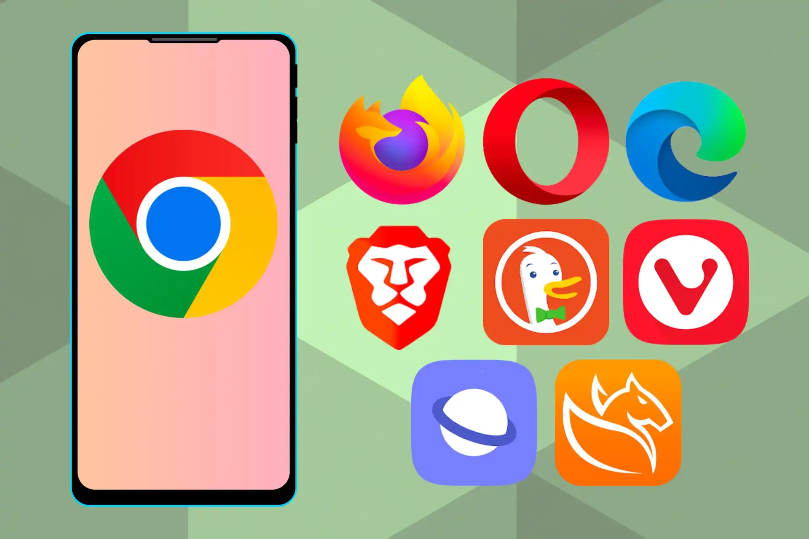
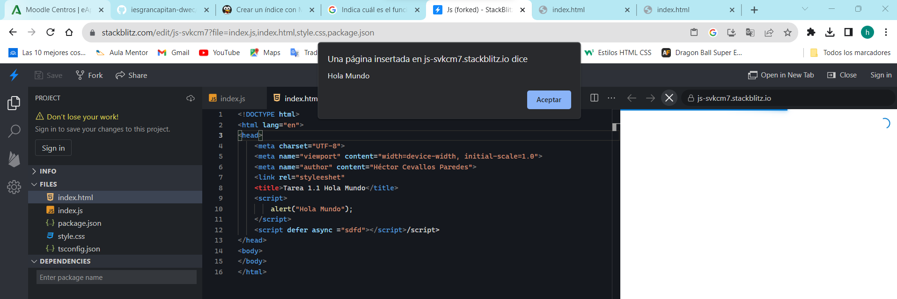

# Tarea 1.3 Navegadores y herramientas de Desarrollo.

*Autor:* Héctor Cevallos Paredes

**Índice**

1. [Qué es un navegador y su relación con el servidor web (HTTP).](#id1)
2. [Indica cuál es el funcionamiento básico de un navegador.](#id2)
3. [Indica qué es Flash y su relación con los navegadores actuales.](#id3)
4. [Indica qué es un applet y su relación con los navegadores actuales.](#id4)
5. [Qué es el motor de renderizado en un navegador. Indica los más destacados en la actualidad y asócialos a cada navegador.](#id5)
6. [Qué es el intérprete de JavaScript (motor JavaScript) en un navegador. Indica los más destacados en la actualidad y asócialos a su navegador.](#id6)
7. [El mismo código JavaScript va a ser ejecutado en distintos navegadores. Explica las particularidades de la programación de guiones y sus ventajas y desventajas sobre la programación tradicional.](#id7)
8. [Firefox cuántico. Averigua qué es y destaca alguna de sus ventajas.](#id8)
9. [Chrome Dev Tools, Chrome Canary y Timeline. Averigua qué hijo.](#id9)
10. [Stackblitz. Averigua qué es y crea un primer proyecto en él. Indica qué ventajas tiene.](#id10)

## 1. Qué es un navegador y su relación con el servidor web (HTTP).
- Un navegador web es un programa que permite ver la información
que contiene una página web. El navegador interpreta el
código, HTML generalmente, en el que está escrita la página web y
lo presenta en pantalla permitiendo al usuario interactuar con su
contenido y navegar.

- Un servidor web es un software que forma parte del servidor y
tiene como misión principal devolver información (páginas)
cuando recibe peticiones por parte de los usuarios mediante algún
protocolo.

## 2. Indica cuál es el funcionamiento básico de un navegador.
- La función principal del navegador es descargar documentos HTML y mostrarlos
en pantalla.
El navegador interpreta el código, HTML generalmente, en el que está escrita la página web y lo presenta en pantalla permitiendo al usuario interactuar con su contenido y navegar.

## 3. Indica qué es Flash y su relación con los navegadores actuales.
- Adobe Flash Player fue una aplicación informática multimedia. Permitía
reproducir archivos en formato SWF, creados con la herramienta Animate CC
o Flex de la propia Adobe, o con otras herramientas de terceros. Estos archivos
se podían reproducir en la web.
El 31 de diciembre de 2020, Adobe finalizó el soporte técnico del programa,
poniéndole fin a 24 años de existencia. Esto significa que a partir de enero de
2021 no recibiría actualizaciones de seguridad ni soporte técnico, lo que significa que no es compatible con los navegadores actuales..

## 4. Indica qué es un applet y su relación con los navegadores actuales.
- El Applet es un programa que puede incrustarse en un documento
HTML (página Web). Cuando un Navegador carga una página Web que
contiene un Applet, éste se descarga en el navegador Web y comienza a
ejecutarse, lo cual nos permite crear programas que cualquier usuario puede
ejecutar.
Su relación con los navegadores depende de ellos:
En Microsoft Edge, Firefox y Safari si funciona.
En Google Chrome no funciona a partir de la versión 42, abril de 2015.

## 5. Qué es el motor de renderizado en un navegador. Indica los más destacados en la actualidad y asócialos a cada navegador.
- Este componente es el encargado de producir una representación visual del
recurso obtenido a partir del acceso a una dirección web.
Algunos de los motores de renderizado más utilizados son:
– Gecko, utilizado en Firefox, Mozilla Suite y otros navegadores como Galeon.
– Trident, el motor de Internet Explorer para Windows.
– WebKit, el motor de Google Chrome, Epiphany y Safari.
– Presto, el motor de Opera.
– Tasman, el motor de Internet Explorer para Mac.

## 6. Qué es el intérprete de JavaScript (motor JavaScript) en un navegador. Indica los más destacados en la actualidad y asócialos a su navegador.
- Las páginas HTML habitualmente llevan código intercalado para la provisión de
ciertas funcionalidades al usuario como puede ser la respuesta a ciertos eventos del ratón o del teclado. El lenguaje comúnmente aceptado para la
programación de este código embebido es JavaScript.
Algunos de los más usados son:
- V8 Engine navegadores basados en Chromium (Chrome, Microsoft Edge,
Opera) y en Node.js y Deno.
- Spider Monkey (Mozilla Firefox).
- Chakra (Microsoft Edge).
- JavaScriptCore basados en Webkit (Apple Safari).

## 7. El mismo código JavaScript va a ser ejecutado en distintos navegadores. Explica las particularidades de la programación de guiones y sus ventajas y desventajas sobre la programación tradicional.
- La programación de guiones o script es un lenguaje de programación el cual el
código se inserta dentro del HTML, este se ejecuta en el navegador al cargar la
página web.
• **Ventajas**:
o Curva de aprendizaje es baja.
o Es muy versátil, se puede integrar con otras tecnologías e insertar
en cualquier página web.
o Reduce la carga del servidor al ejecutarse en el lado del cliente.
o Mayor velocidad por que se ejecuta en el lado del servidor.
o Crea interfaces dinámicas.
o Es multiplataforma, se ejecuta en distintos sistemas operativos y
en cualquier navegador.
o Se actualiza con frecuencia.
• **Desventajas**:
o Vulnerable, ya que los scripts pueden ser leídos por otros usuarios.
o Se puede desactivar las funcionalidades.

## 8. Firefox Quantum. Averigua qué es y destaca alguna de sus ventajas.
- Firefox Quantum es un navegador de código abierto.
• **Trabaja en paralelo**: el nuevo motor de renderizado, llamado Servo,
aprovecha todos los núcleos de proceso de tu CPU, así que trabaja en
paralelo y hace que sobre todo si trabajas con varias pestañas esa nueva
filosofía permita que todo vaya más rápido y más suave.
• **Cada pestaña, un proceso (más o menos)**: el proyecto Electrolysis es otro
de los componentes clave del nuevo Firefox Quantum, que adopta un
modelo similar (pero no idéntico) al de Chrome y considera cada pestaña
como un proceso separado, pero dividiendo toda la gestión en cuatro
grandes procesos que como indican los responsables de Mozilla permite
gestionar multitud de pestañas de forma óptima.
• **Nuevo look**: también hay cambios en el aspecto visual del navegador,
que tiene menús más simples y mejor organizados y que además permite
optar por usar la barra de direcciones como barra de búsqueda si así lo
deseamos.
• **Privacidad, velocidad y consumo de datos**: la tecnología Tracking
Protection de Firefox bloquea las peticiones de los dominios que
monitorizan nuestra actividad en la web, y según sus estudios el
navegador reduce en un 67,5% las cookies HTTP durante las visitas a los
sitios web. Eso tiene otro beneficio asociado: todo va más rápido (un 44%
más) porque se cargan menos cosas, y además consumimos menos datos
(un 39% menos) gracias a ese bloqueo de scripts y cookies.

## 9. Chrome Dev Tools, Chrome Canary y Timeline. Averigua qué son.
-  Chrome Dev Tools: Chrome DevTools es un conjunto de
herramientas de desarrollo web integradas directamente en el
navegador Google Chrome.
- Chrome Canary: Google Chrome Canary es un navegador web de
la familia de Google Chrome que recibe actualizaciones muy
experimentales que no han sido probadas y son inestables.
- Timeline: TimelineJS es una herramienta de código abierto que
permite a cualquier persona crear líneas de tiempo interactivas.

## 10. Stackblitz. Averigua qué es y crea un primer proyecto en él. Indica qué ventajas tiene.
- Stackblitz es un IDE online que permite desarrollar de forma rápida proyectos
Angular, React o Ionic.

