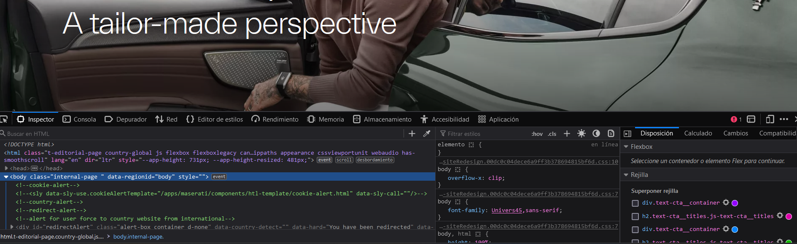

## TAREA 1.1. HOLA MUNDO
#### *Autor: Héctor Cevallos Paredes*

___
### Implementa los ejemplos propuestos en el apartado 1.4 del tema y pruébalo con los distintos navegadores web (Chrome, Edge, Firefox, Opera...)

###*Chrome*
#####Ejercicio 1

#####Ejercicio 2

#####Ejercicio 3

###*Firefox*
#####Ejercicio 1

#####Ejercicio 2

#####Ejercicio 3

###*Edge*
#####Ejercicio 1

#####Ejercicio 2

#####Ejercicio 3

___

### Utiliza al menos tres entornos de desarrollo: Intellij, Sublime, Atom, Visual Studio Code...

#### Realiza un tutorial por cada uno de los editores donde aparezca:

### *Visual Studio Code* 
~~~~
En Visual Studio Code no es necesario ningún tipo de extensión para reconocer el código html o javascript solo hace falta guardar el archivo con la extensión que deseemos.
Visual Studio proporciona compatibilidad enriquecida para el desarrollo con JavaScript

Atajos
html:5 + enter: escribe automáticamente la estructura básica de html.
¡ + enter: escribe automáticamente la estructura básica de html.
Alt +flecha de arriba o abajo: Mueve toda la línea de código hacia arriba o abajo
Ctrl + d: selecciona una palabra en todo el archivo.
Crtl +shift +flecha de arriba o debajo: copia la línea arriba o abajo.
~~~~

### *Atom* 
~~~~
Atom es un editor de texto muy completo especializado en programación. Compatible con los lenguajes más populares, permite escribir código y programar cómodamente desde tu PC con Windows o Linux o desde tu Mac con macOS.

Atajos
html + enter: escribe automáticamente la estructura básica de html.
Ctrl +shift + 7: comenta la línea o líneas de código selecciondo.
Alt + flecha de arriba o abajo: selecciona todo lo de dentro de la etiqueta.
Ctrl + d: selecciona una palabra en todo el archivo.
Ctrl +flecha de arriba o abajo: Mueve toda la línea de código hacia arriba o abajo

~~~~

### *Sublime text* 
~~~~
Es un editor de texto para escribir código en casi cualquier formato de archivo. Está especialmente pensado para escribir sin distracciones. Es decir, que visualmente ofrece un entorno oscuro donde las líneas de código que escribas resaltarán para que puedas centrarte exclusivamente en ellas

Atajos
html + tab: escribe automáticamente la estructura básica de html.
Crtl +shift +flecha de arriba o debajo: copia la línea arriba o abajo.
Ctrl + Shift + p: se usa para cambiar rápidamente el tipo de archivo o instalar el complemento.
Ctrl +g: localiza una línea.
Ctrl +shift + d: copia la línea.
~~~~

____

## En los tres navegadores indica:
    1. Teclas de acceso rápido que muestren las herramientas de desarrollo.
    2. Acceso a la consola
    3. Acceso a los ficheros
    4. Reglas CSS
    5. Depurador

#### *Brave*

##### CTRL + SHIFT + I

##### CTRL + SHIFT + J

##### Acceso a los Ficheros
###### CTRL + O
##### Reglas CSS
CTRL + SHIFT + J, en la pestaña "Elements" se pueden editar las reglas CSS

##### Depurador
CTRL + SHIFT + J, en la pestaña"Sources" se pueden establecer puntos de ruptura y depurar.

____

#### *Chrome*

##### CTRL + SHIFT + I

##### CTRL + SHIFT +J

##### Acceso a los Ficheros
###### CTRL + O
##### Reglas CSS
CTRL + SHIFT + J, en la pestaña "Elements" se pueden editar las reglas CSS

##### Depurador
CTRL + SHIFT + J, en la pestaña"Sources" se pueden establecer puntos de ruptura y depurar.

#### *Firefox*

##### CTRL + SHIFT + I

##### CTRL + SHIFT +J

##### Acceso a los Ficheros
###### CTRL + O
##### Reglas CSS
CTRL + SHIFT + J, en la pestaña "Inspector" se pueden editar las reglas CSS

##### Depurador
CTRL + SHIFT + J, en la pestaña"Depurador" se pueden establecer puntos de ruptura y depurar.

